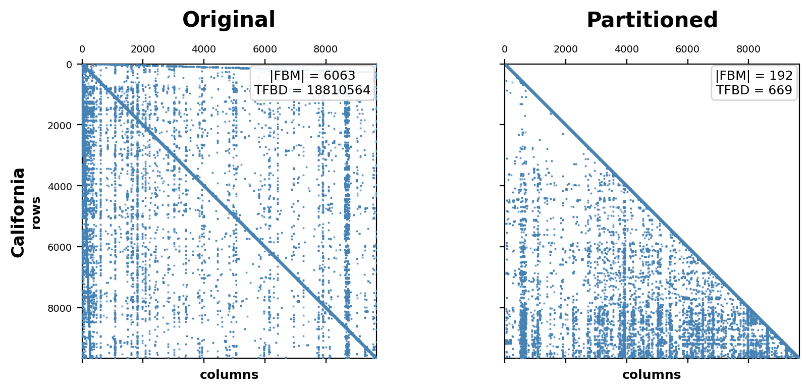
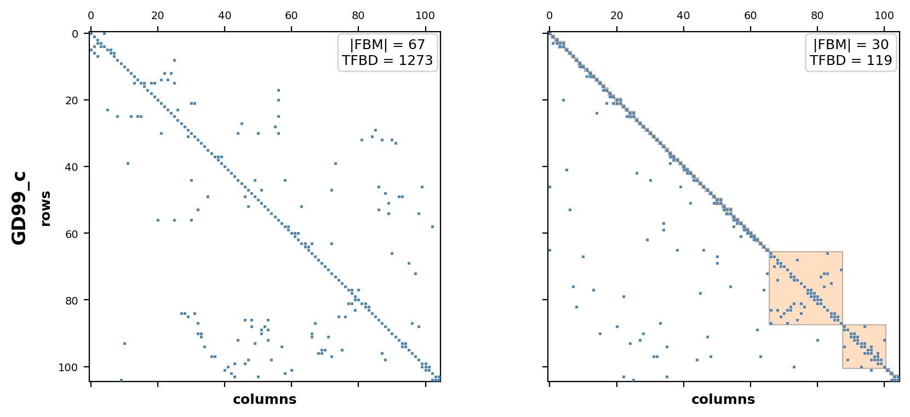
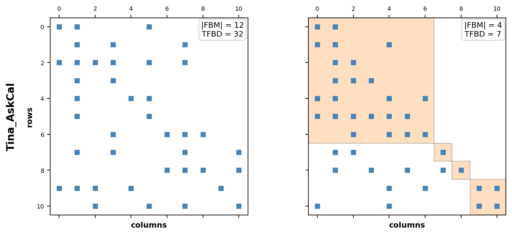
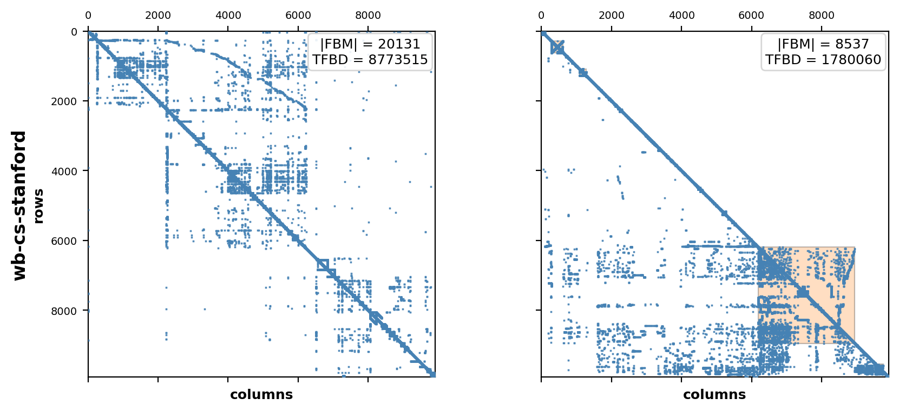
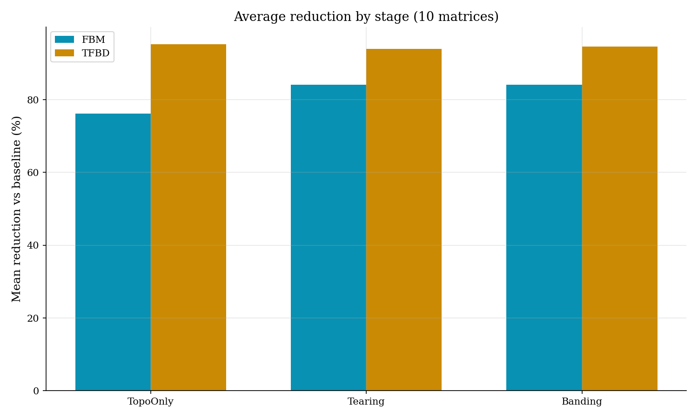
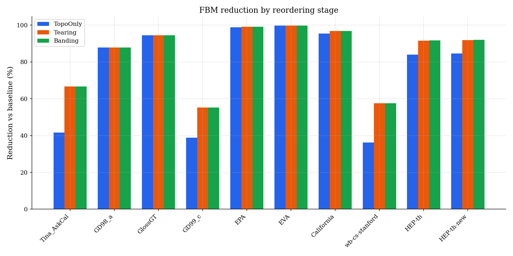
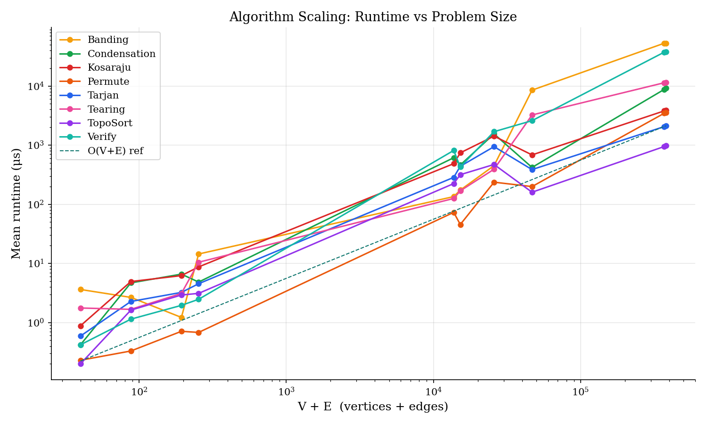
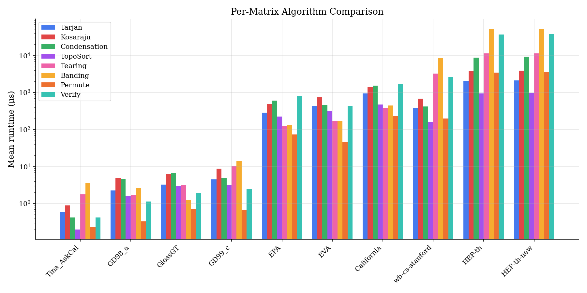

# Design Structure Matrix Optimization

**CPSC 482 -- Data Structures II, University of Northern British Columbia**

## Overview

Large-scale engineering and software projects involve hundreds or thousands of interdependent tasks. A Design Structure Matrix (DSM) is a square binary matrix where entry (i, j) = 1 indicates that task i depends on task j. Dependencies fall into three categories:

- **Feed-forward** (below the diagonal): resolved in sequence
- **Feed-back** (above the diagonal): cause rework and iteration
- **Coupled** (mutual): require tasks to iterate together

The goal is to find a permutation of rows and columns that minimizes the number of feed-back marks (FBM) and their total distance from the diagonal (TFBD), pushing the matrix toward Block Lower Triangular Form (BLTF). This reduces iteration overhead and clarifies which tasks must be developed concurrently.

## Pipeline

The implementation is a six-stage optimization pipeline in C++17:

1. **Parsing** -- Load sparse matrices in Matrix Market format into Compressed Sparse Column (CSC) representation
2. **SCC Decomposition** -- Identify strongly connected components using either Tarjan's or Kosaraju-Sharir's algorithm (both implemented; Tarjan runs ~1.8x faster)
3. **Condensation and Topological Sort** -- Contract each SCC into a supernode and sort the resulting DAG using Kahn's algorithm
4. **Tearing** -- Approximate the minimum feedback arc set within each non-trivial SCC using Algorithm GR (Eades, Lin & Smyth, 1993)
5. **Banding** -- Reduce bandwidth with Reverse Cuthill-McKee ordering, then refine with adjacent-swap hill climbing (accepts swaps only if TFBD decreases without increasing FBM)
6. **Permutation** -- Build the global permutation, apply the symmetric reordering P^T A P, and verify correctness

## Results

The full pipeline achieves an average **84% reduction in FBM** and **93% reduction in TFBD** across 10 benchmark matrices ranging from 11 to 27,770 vertices.

### Original vs. Partitioned Matrices

| California (9664 vertices) | GD99_c (105 vertices) |
|---|---|
|  |  |

| Tina_AskCal (11 vertices) | wb-cs-stanford (9914 vertices) |
|---|---|
|  |  |

### Optimization by Stage



### FBM Reduction per Matrix



### Algorithm Scaling



### Per-Matrix Algorithm Comparison



## Building and Running

Requires `clang++` (or any C++17 compiler) and `make`.

```bash
make
```

### Interactive mode

Select a matrix, run the pipeline, and inspect the results:

```bash
./out/main
```

### Benchmark mode

Process all matrices in `data/`, export timing and optimization metrics:

```bash
./out/main --bench
```

Outputs:
- `out/benchmark.csv` -- algorithm timing data
- `out/optimization_metrics.csv` -- FBM/TFBD at each pipeline stage
- `out/permuted/*.mtx` -- permuted matrices

### Generating plots

Requires Python 3 with `numpy`, `scipy`, and `matplotlib`.

```bash
python3 scripts/plot_benchmarks.py
python3 scripts/plot_optimization_metrics.py
python3 scripts/plot_reordering.py --compare California GD99_c Tina_AskCal wb-cs-stanford \
    --markersizes 0.25 1.0 5.0 0.25 --output-dir report/figures/
```

## Project Structure

```
.
├── Makefile
├── data/            # Benchmark sparse matrices (.mtx)
├── include/         # Header files (.hpp)
├── src/             # Implementation files (.cpp)
├── scripts/         # Python visualization scripts
├── report/          # LaTeX report and presentation
│   └── figures/     # Original vs. permuted matrix plots
└── out/             # Build artifacts, CSVs, and generated plots
```

## Authors

- **Simon Kraft** -- University of Bonn / UNBC
- **Joshua Payne** -- UNBC
- **El Sall** -- UNBC

## License

MIT
